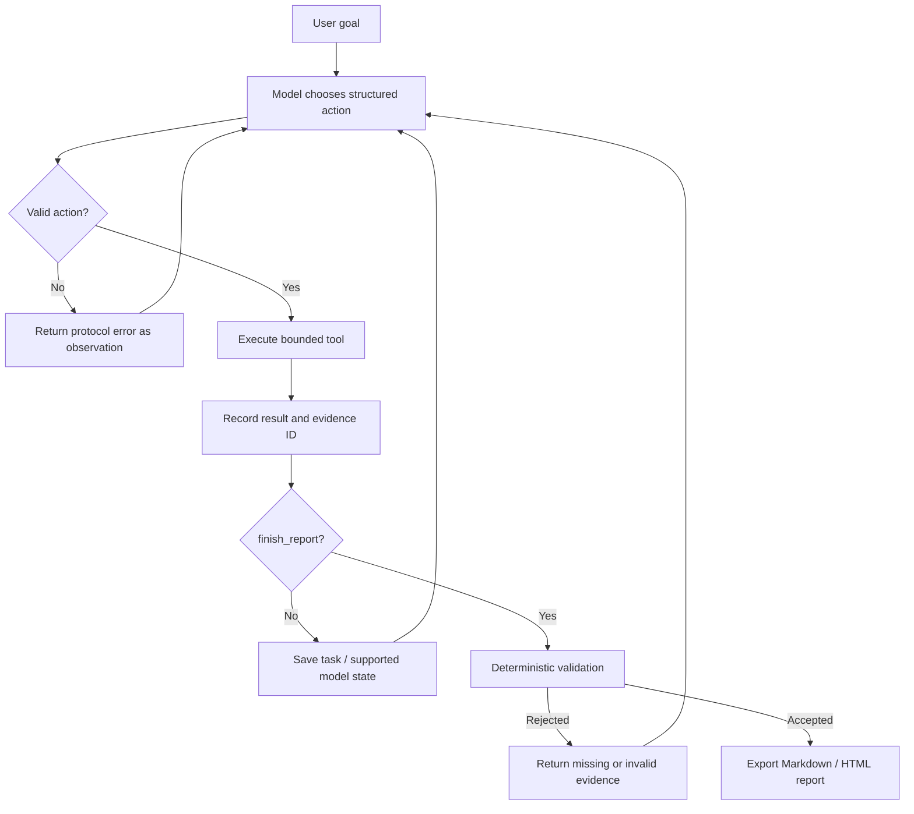

# RWKV StateTrace Agent

A code-diagnosis runtime with auditable tool observations, checked reports and verified task checkpoints. Native RWKV integration is an adapter contract; it has not been measured with a real native runtime in this audit.

> Project status: an engineering demonstration, not a production security sandbox. The bundled Replay demo is deterministic recorded behavior—not live model inference. A standard text API is live inference but does not expose native RWKV recurrent state. Only a compatible Direct adapter may claim native state checkpointing.

## What it demonstrates

The engineering problem is preserving exact evidence and recoverable task state when an agent emits invalid actions, repeats work or proposes an unsupported final report.

## Engineering decisions

- [Keep state semantics explicit](docs/decisions/001-state-boundaries.md): Replay stores a cursor, API mode stores task/trace, and only a compatible native adapter can serialize recurrent tensors.
- [Validate all checkpoint artifacts](docs/decisions/002-artifact-integrity.md): hashing just the model blob would leave task metadata and evidence open to undetected corruption.
- [Validate evidence before completion](docs/decisions/003-deterministic-evidence.md): return rejected claims as observations so a controller can continue rather than silently accepting them.

## Baseline, failure cases and experiments

The comparison baseline is accepting a structured report without checking evidence, or saving only a backend blob. These are design alternatives, not measured historical model baselines. Existing regression cases inject unknown evidence, contradictory test counts, corrupt metadata and malformed actions; the audit executes them through the current implementation.

| Experiment | Observed result | What it establishes |
|---|---|---|
| [State resume](docs/experiments/state-resume.md) | 16/16 contract cases passed | Task/history restoration, Replay continuation and fake-backend integrity checks |
| [Fork behavior](docs/experiments/fork-behavior.md) | 2/2 clone cases passed | Independent artifacts; corrupt source rejection |
| [Evidence validation](docs/experiments/evidence-validation.md) | 15/15 cases passed | Protocol and evidence rejection behavior |
| Intentional teaching fixture | 3 failed, 1 passed, exit 1 | The diagnosed defect remains reproducible |

Run `uv sync --extra dev && uv run python scripts/run_contract_experiments.py`. [Raw results](docs/experiments/contract-results.json) contain named cases and environment. Groups overlap; do not sum them as distinct tests. Live API inference, native recurrent state, quality and speedup were **not run**. The [corruption failure log](docs/failures/001-corrupted-checkpoint.md) explains the guard being tested.

## Ablation and trade-offs

No neural memory or component-performance ablation has been measured. Replay and fake adapters isolate controller contracts only. Exact evidence adds storage; retained checkpoint history grows with snapshot count. Hashes detect corruption but do not authenticate an attacker-writable manifest. Deterministic evidence checks do not prove the semantics of every diagnosis.

## System

StateTrace accepts a goal such as:

```text
Run the tests, diagnose the date-boundary failures, cite the relevant source
and test lines, and recommend a minimal fix without modifying files.
```

The model—not a hard-coded workflow—selects a tool and its arguments. The controller validates that action, executes it inside a bounded workspace, assigns an evidence ID to the result, and feeds the observation back to the model. A proposed final report is checked against the trace before the task can complete.



The project focuses on the connection between a long-running Agent loop and RWKV-7's fixed-shape recurrent state. It preserves exact tool evidence separately because neural state is compressed working memory, not an auditable database.

## Three modes, three different claims

| Mode | Model decisions | Live generation | Checkpointed value | Native RWKV state? | Purpose |
| --- | --- | ---: | --- | ---: | --- |
| `rwkv-direct` | Compatible local RWKV adapter | Yes | Recurrent tensors plus task state | **Yes**, when the adapter exposes it | RWKV state experiments |
| `rwkv-api` | OpenAI-compatible RWKV endpoint | Yes | Task/trace only | **No** under the normal text API | Remote Agent execution |
| `replay` | Recorded action sequence | No | Replay cursor plus task state | **No** | CI and one-command demo |

Replay's cursor is checkpointable so recovery code can be tested. It must never be described as a neural checkpoint. Likewise, an API server's conversation ID is not evidence that native RWKV tensors were saved.

## Quick start

Requirements:

- Python 3.11 or later;
- `rg` (ripgrep) for `search_code`;
- a trusted local workspace; and
- no model download for Replay mode.

Clone this repository, then create an environment and install it in editable mode from the repository root:

```bash
python -m venv .venv
source .venv/bin/activate
python -m pip install -e '.[dev]'
```

For a wheel/package installation, include the Demo dependency:

```bash
python -m pip install 'rwkv-statetrace-agent[demo]'
```

The bundled `demo` copies a packaged teaching fixture into a new directory under `.statetrace/demo-workspaces/`, so repeated runs do not overwrite an earlier task's workspace. The `demo` extra installs pytest because the teaching run invokes it. The top-level `examples/` copy remains available for inspection in a source checkout.

Run the deterministic demonstration:

```bash
statetrace demo
```

The demo operates only on its copied teaching fixture under `.statetrace/demo-workspaces/`. Its inspectable source copy is `examples/fixture_repo`. The fixture contains an intentional month-boundary defect, so its own test suite should finish with `1 passed, 3 failed`. The Agent diagnoses it; it does not modify it. If pytest is absent, the CLI stops before creating a misleading “completed” diagnosis and prints the exact installation command.

Inspect generated task artifacts under `.statetrace/` and export a report if needed:

```bash
statetrace status --task-id <task-id>
statetrace export --task-id <task-id> --format html
```

Run project tests:

```bash
python -m pytest -q tests
```

The fixture failure is checked separately because it is expected:

```bash
cd examples/fixture_repo
python -m pytest -q
# expected: exit 1, with 1 passed and 3 failed
```

## Live execution

### OpenAI-compatible RWKV API

Copy `.env.example`, set endpoint variables in your environment, then run:

```bash
export RWKV_API_BASE_URL=http://127.0.0.1:8000/v1
export RWKV_API_MODEL=rwkv7
export RWKV_API_KEY='your-key-if-required'

statetrace run \
  --workspace examples/fixture_repo \
  --goal "Run the tests, diagnose the failures, and cite exact evidence." \
  --backend rwkv-api
```

API mode is live model inference. The common chat-completions protocol returns text, not recurrent tensors, so StateTrace does **not** advertise native state save/resume for this backend.

### Direct RWKV adapter (Python integration contract)

Direct mode is an adapter contract, not a bundled model runtime. Install a compatible native runtime and obtain model weights separately under their respective terms. The adapter must implement generation plus `save_state`, `load_state` and `clone_state`; StateTrace fails closed when those capabilities are missing.

The current CLI does not instantiate an arbitrary native runtime: `statetrace run` supports `rwkv-api`, while `rwkv-direct` deliberately exits with an explanation. Integrate Direct mode through Python by implementing `NativeRWKVAdapter`, constructing `RWKVDirectBackend(adapter)`, and passing it to `AgentController`. No weights are committed to this repository. See the contract in `src/statetrace/backends/direct.py`.

## Tools and safety controls

| Tool | Purpose | Important boundary |
| --- | --- | --- |
| `list_files` | inspect a sorted workspace tree | bounded depth/count; excluded internals |
| `search_code` | find text with `rg` | bounded results and output |
| `read_file` | read exact, numbered source ranges | no binary/out-of-root access; line cap |
| `run_tests` | run a supported test command | argv parsing, allowlist, no shell, timeout |
| `calculator` | deterministic arithmetic | AST/operator allowlist; no `eval` |
| `finish_report` | propose a cited diagnosis | rejected if evidence checks fail |

Allowlisting a test command does not make untrusted repository code safe: tests can execute arbitrary code. Run unfamiliar code in an OS/container sandbox. The prototype itself is not such a sandbox.

## Action and evidence protocol

A model emits one action at a time:

```json
{
  "type": "tool_call",
  "thought_summary": "The failures occur at boundaries; inspect the date helper.",
  "tool": "read_file",
  "arguments": {
    "path": "src/calendar_edge/dates.py",
    "start_line": 1,
    "end_line": 80
  }
}
```

The short `thought_summary` is an operational rationale, not private chain-of-thought. Malformed JSON, unknown tools and invalid arguments become observations with typed error codes; the model can correct itself on the next step.

Every executed tool result receives an ID such as `obs-003`. Final findings must cite existing evidence:

```json
{
  "file": "src/calendar_edge/dates.py",
  "line": 20,
  "claim": "The month-end branch preserves the original month and year.",
  "evidence_ids": ["obs-003"]
}
```

The validator checks referenced evidence, path existence, line ranges and recorded test execution. A failure returns to the Agent loop rather than silently accepting an unsupported answer.

## Persistence and recovery

After completed steps, the checkpoint manager stores exact task metadata and, when the backend supports it, the backend-owned state artifact:

```text
.statetrace/checkpoints/<task-id>/step_0004/
├── task_state.json
├── model_state.bin          # only when a supported state exists
├── model_state.meta.json
├── checksum.sha256          # only with model_state.bin
├── integrity.sha256         # hashes every durable checkpoint artifact
└── trace.jsonl
```

Resume and fork operations verify the complete artifact manifest, format, task identity, backend, model name, state size and checksum before loading state:

```bash
statetrace resume --task-id <task-id>
statetrace fork --task-id <task-id> --from-step 4 --new-task-id alternative-search
```

`resume` is intentionally conservative: it reports already completed tasks without repeating actions. A stopped live task requires the original backend configuration, so generic CLI resume currently directs the caller to `CheckpointManager.load` and `AgentController` in Python. `fork` clones checkpoint artifacts; starting a new continuation also requires the corresponding backend/controller integration.

Saving many fixed-size neural states still uses storage proportional to the number of snapshots. StateTrace never calls the total checkpoint history “constant size.”

## Repository layout

```text
.
├── src/statetrace/
│   ├── backends/       # Direct, API and Replay boundaries
│   ├── tools/          # bounded code-analysis tools
│   ├── controller.py   # feedback loop / state machine
│   ├── checkpoints.py  # verified persistence and cloning
│   ├── protocol.py     # untrusted model-output parsing
│   ├── trace.py        # append-only JSONL events
│   └── validator.py    # deterministic final checks
├── examples/
│   ├── fixture_repo/   # intentionally faulty, trusted demo project
│   ├── replay_demo.json
│   └── tasks.json
├── tests/
├── docs/
└── .github/workflows/ci.yml
```

## Reading guide

- [RWKV-7 implementation notes](docs/rwkv7-notes.md): NumPy recurrence, TimeMix/ChannelMix and state semantics.
- [DPLR explained](docs/dplr-explained.md): diagonal decay, low-rank correction and affine composition.
- [Agent loop](docs/agent-loop.md): autonomy/control boundary, recovery and evidence.
- [Limitations](docs/limitations.md): model, security, performance and compatibility limits.
- [AI-assisted development](docs/AI_ASSISTED_DEVELOPMENT.md): current audit and technical ownership, linking the retained [earlier AI usage record](docs/ai-usage.md).

Primary references supplied with the assignment:

1. [RWKV Agent Project Directory](https://agent.objects.rwkvos.com)
2. [RWKV-7 NumPy reference](https://github.com/BlinkDL/RWKV-LM/blob/main/RWKV-v7/rwkv_v7_numpy.py)
3. [RWKV-7 / Qwen3.5 NumPy runner](https://github.com/BlinkDL/RWKV-LM/blob/main/RWKV-v7/run_rwkv7_qwen35.py)
4. [Albatross](https://github.com/BlinkDL/Albatross)
5. [RWKV-7 training examples](https://github.com/BlinkDL/RWKV-LM/tree/main/RWKV-v7/train_temp)
6. [DPLR mathematics](https://zhiyuan1i.github.io/posts/dplr-mathematics)
7. [rwkv-mobile](https://github.com/MollySophia/rwkv-mobile)
8. [RWKV.com project index source](https://github.com/BlinkDL/RWKV.com/blob/master/js/index.js)
9. [GitHub RWKV repository search](https://github.com/search?o=desc&p=1&q=rwkv&s=updated&type=Repositories)

## Honest interpretation of results

StateTrace can demonstrate that a particular direct runtime restored a recurrent checkpoint and avoided replaying a measured prefix. It does not establish lossless infinite memory, universal superiority over Transformer or hybrid architectures, or production-grade autonomous software engineering. Benchmark reports must name the exact model, runtime, hardware, precision and prompt.

## License

Project code and original documentation are available under the [MIT License](LICENSE). Model weights, runtimes and referenced projects keep their own licenses.
