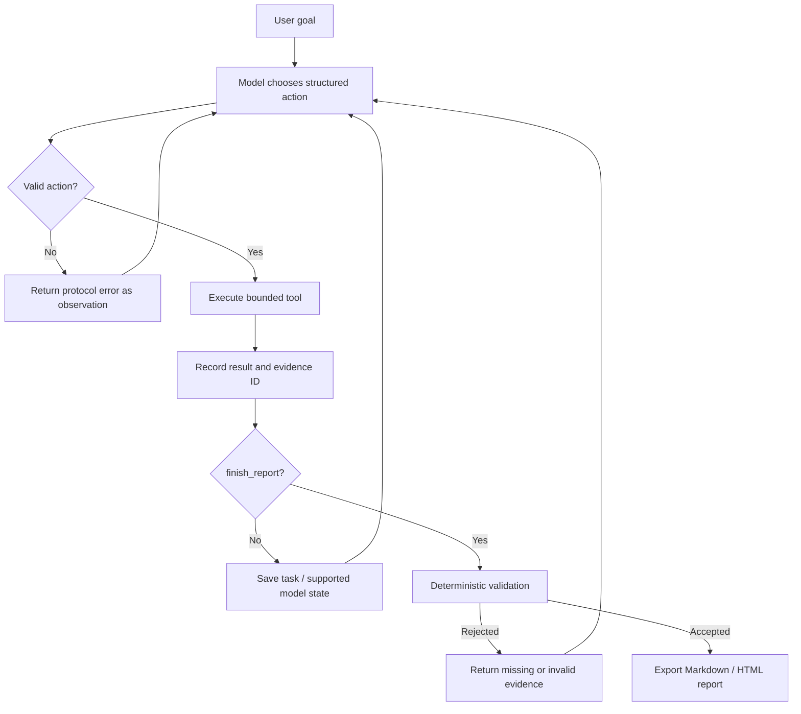

# RWKV StateTrace Agent

A code-diagnosis runtime with auditable tool observations, checked reports and verified task checkpoints. Native RWKV integration is an adapter contract; it has not been measured with a real native runtime in this audit.

> Project status: an engineering demonstration, not a production security sandbox. The bundled Replay demo is deterministic recorded behavior—not live model inference. A standard text API is live inference but does not expose native RWKV recurrent state. Only a compatible Direct adapter may claim native state checkpointing.

## What it demonstrates

The engineering problem is preserving exact evidence and recoverable task state when an agent emits invalid actions, repeats work or proposes an unsupported final report.

## Engineering decisions

- [Keep state semantics explicit](docs/decisions/001-state-boundaries.md): Replay stores a cursor, API mode stores task/trace, and only a compatible native adapter can serialize recurrent tensors.
- [Validate all checkpoint artifacts](docs/decisions/002-artifact-integrity.md): hashing just the model blob would leave task metadata and evidence open to undetected corruption.
- [Validate evidence before completion](docs/decisions/003-deterministic-evidence.md): return rejected claims as observations so a controller can continue rather than silently accepting them.

## Baseline, failure cases and experiments

The comparison baseline is accepting a structured report without checking evidence, or saving only a backend blob. These are design alternatives, not measured historical model baselines. Existing regression cases inject unknown evidence, contradictory test counts, corrupt metadata and malformed actions; the audit executes them through the current implementation.

| Experiment | Observed result | What it establishes |
|---|---|---|
| [State resume](docs/experiments/state-resume.md) | 16/16 contract cases passed | Task/history restoration, Replay continuation and fake-backend integrity checks |
| [Fork behavior](docs/experiments/fork-behavior.md) | 2/2 clone cases passed | Independent artifacts; corrupt source rejection |
| [Evidence validation](docs/experiments/evidence-validation.md) | 15/15 cases passed | Protocol and evidence rejection behavior |
| Intentional teaching fixture | 3 failed, 1 passed, exit 1 | The diagnosed defect remains reproducible |

Run `uv sync --extra dev && uv run python scripts/run_contract_experiments.py`. [Raw results](docs/experiments/contract-results.json) contain named cases and environment. Groups overlap; do not sum them as distinct tests. Live API inference, native recurrent state, quality and speedup were **not run**. The [corruption failure log](docs/failures/001-corrupted-checkpoint.md) explains the guard being tested.

## Ablation and trade-offs

No neural memory or component-performance ablation has been measured. Replay and fake adapters isolate controller contracts only. Exact evidence adds storage; retained checkpoint history grows with snapshot count. Hashes detect corruption but do not authenticate an attacker-writable manifest. Deterministic evidence checks do not prove the semantics of every diagnosis.

## System

StateTrace accepts a goal such as:

```text
Run the tests, diagnose the date-boundary failures, cite the relevant source
and test lines, and recommend a minimal fix without modifying files.
```

The model—not a hard-coded workflow—selects a tool and its arguments. The controller validates that action, executes it inside a bounded workspace, assigns an evidence ID to the result, and feeds the observation back to the model. A proposed final report is checked against the trace before the task can complete.



The project focuses on the connection between a long-running Agent loop and RWKV-7's fixed-shape recurrent state. It preserves exact tool evidence separately because neural state is compressed working memory, not an auditable database.

## Three modes, three different claims

| Mode | Model decisions | Live generation | Checkpointed value | Native RWKV state? | Purpose |
| --- | --- | ---: | --- | ---: | --- |
| `rwkv-direct` | Compatible local RWKV adapter | Yes | Recurrent tensors plus task state | **Yes**, when the adapter exposes it | RWKV state experiments |
| `rwkv-api` | OpenAI-compatible RWKV endpoint | Yes | Task/trace only | **No** under the normal text API | Remote Agent execution |
| `replay` | Recorded action sequence | No | Replay cursor plus task state | **No** | CI and one-command demo |

Replay's cursor is checkpointable so recovery code can be tested. It must never be described as a neural checkpoint. Likewise, an API server's conversation ID is not evidence that native RWKV tensors were saved.

## Run the Replay example

```bash
python -m pip install -e '.[dev]'
statetrace demo
```

The copied teaching fixture intentionally has three failing tests and one passing test. The runtime should report those failures with source evidence. Generated traces live under `.statetrace/`.

[Operation and integration](OPERATIONS.md) covers API configuration, native adapter requirements, tool restrictions, the action protocol and checkpoint recovery.

## Reading guide

- [RWKV-7 implementation notes](docs/rwkv7-notes.md): NumPy recurrence, TimeMix/ChannelMix and state semantics.
- [DPLR explained](docs/dplr-explained.md): diagonal decay, low-rank correction and affine composition.
- [Agent loop](docs/agent-loop.md): autonomy/control boundary, recovery and evidence.
- [Limitations](docs/limitations.md): model, security, performance and compatibility limits.
- [AI-assisted development](docs/AI_ASSISTED_DEVELOPMENT.md): current audit and technical ownership, linking the retained [earlier AI usage record](docs/ai-usage.md).

Implementation references:

1. [RWKV Agent Project Directory](https://agent.objects.rwkvos.com)
2. [RWKV-7 NumPy reference](https://github.com/BlinkDL/RWKV-LM/blob/main/RWKV-v7/rwkv_v7_numpy.py)
3. [RWKV-7 / Qwen3.5 NumPy runner](https://github.com/BlinkDL/RWKV-LM/blob/main/RWKV-v7/run_rwkv7_qwen35.py)
4. [Albatross](https://github.com/BlinkDL/Albatross)
5. [RWKV-7 training examples](https://github.com/BlinkDL/RWKV-LM/tree/main/RWKV-v7/train_temp)
6. [DPLR mathematics](https://zhiyuan1i.github.io/posts/dplr-mathematics)
7. [rwkv-mobile](https://github.com/MollySophia/rwkv-mobile)
8. [RWKV.com project index source](https://github.com/BlinkDL/RWKV.com/blob/master/js/index.js)
9. [GitHub RWKV repository search](https://github.com/search?o=desc&p=1&q=rwkv&s=updated&type=Repositories)

## Honest interpretation of results

A compatible direct runtime still needs an uninterrupted-versus-resumed experiment before this project can report native checkpoint behavior or saved prefix work. It does not establish lossless infinite memory, universal superiority over Transformer or hybrid architectures, or production-grade autonomous software engineering. Benchmark reports must name the exact model, runtime, hardware, precision and prompt.

## License

Project code and original documentation are available under the [MIT License](LICENSE). Model weights, runtimes and referenced projects keep their own licenses.
